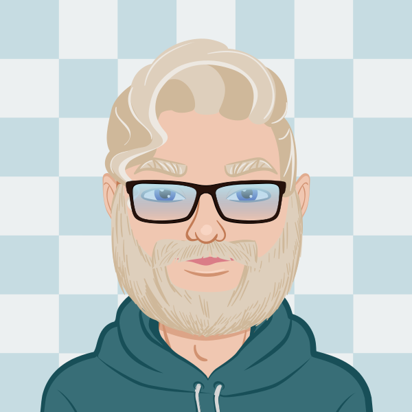

### Hi there 👋

### About me

Technology professional with over twenty-five years of extensive experience in all aspects of the software
development/support life cycle.
 

Primary area of expertise is building, deploying, and maintaining secure,
dynamic, well tested, data driven enterprise applications using .NET and Python technologies.

- 🔭 I’m currently working on supporting the Census [Decennial Census Digitization and Linkage (DCDL) Project](https://www.census.gov/programs-surveys/dcdl.html)
in creating python based indexing and workflow tools that index and process over 4 Petabytes of Census submitted data over the course of four decades (1960 - 1990) 

- 🌱 I’m currently studying for my Comptia Linux+ Certification 

### 🛠 &nbsp;Languages :

<!--

-->

<!--
**OldKayakFisherman/oldkayakfisherman** is a ✨ _special_ ✨ repository because its `README.md` (this file) appears on your GitHub profile.

Here are some ideas to get you started:

- 🔭 I’m currently working on ...
- 🌱 I’m currently learning ...
- 👯 I’m looking to collaborate on ...
- 🤔 I’m looking for help with ...
- 💬 Ask me about ...
- 📫 How to reach me: ...
- 😄 Pronouns: ...
- ⚡ Fun fact: ...
-->
